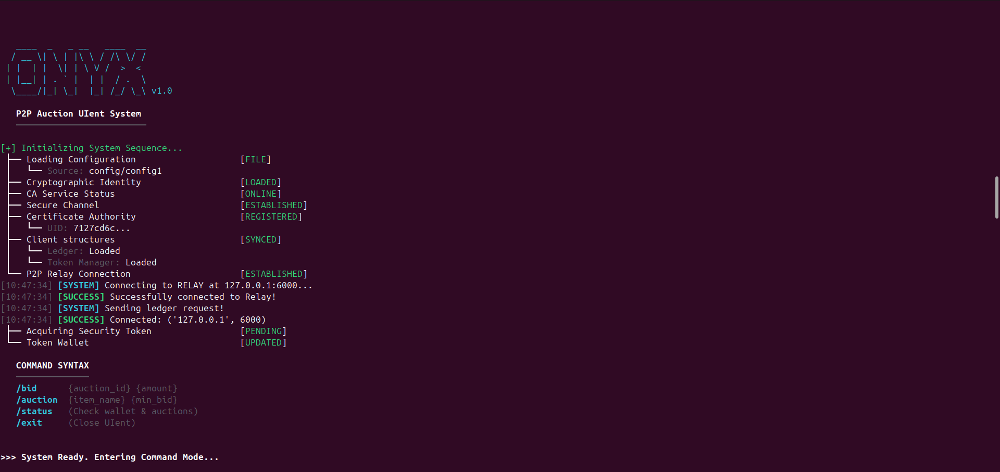
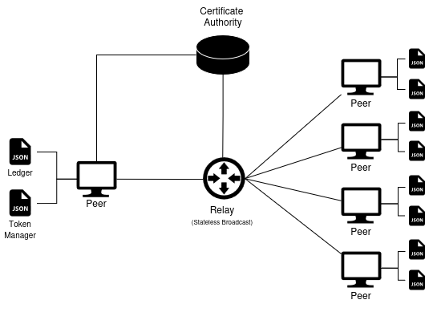

# Onyx: P2P Auction System



> **A privacy-preserving peer-to-peer auction protocol using Blind Signatures and a Localized Blockchain Ledger.**

**Onyx** is a decentralized auction system designed to guarantee bidder anonymity, message integrity, and non-repudiation. It separates identity from action using **RSA Blind Signatures**, allowing users to bid anonymously while maintaining a verifiable history of events on a local blockchain.

## 🚀 Features

  * **P2P Architecture:** Decentralized logic with a stateless relay for broadcasting.
  * **Total Anonymity:** Bids are submitted using unlinked tokens; IP addresses are masked by the relay.
  * **Blind Signatures:** The Certificate Authority (CA) signs tokens without knowing their value.
  * **Local Ledger:** Each peer maintains a blockchain to prevent double-spending and ensure integrity.
  * **Selective Reveal:** Only the winner and seller exchange identities at the end of an auction.

-----

## 🛠️ Installation

### Prerequisites
* **Python 3.12+**: This system relies on features introduced in Python 3.12. Please ensure you have this version or newer installed.

### Steps

1.  **Clone the repository:**

    ```bash
    git clone git@github.com:Diog0martins/Onyx-P2P-Auction-System.git
    cd Onyx-P2P-Auction-System
    ```

-----

## 💻 Usage

To run the system, you must start the components in the specific order: **CA** $\rightarrow$ **Relay** $\rightarrow$ **Peers**.

### 1\. Start the Certificate Authority (CA)

The CA handles user registration, token signing, and timestamping.

```bash
python3 ca_p2p.py
```

### 2\. Start the Relay Server

The Relay acts as the broadcast middleware for the network.

```bash
python3 relay_server.py
```

### 3\. Start Peers

Run multiple instances of the peer application in separate terminal windows. We have prepared configuration files (`config1`, `config2`, `config3`, `config4`) to simulate different users.

**Terminal 1 (Alice):**

```bash
python3 p2p_auction.py config1
```

**Terminal 2 (Bob):**

```bash
python3 p2p_auction.py config2
```

**Terminal 3 (Charlie):**

```bash
python3 p2p_auction.py config3
```

-----

## 🎮 Interactive Commands

Once a peer is running, you can use the CLI to interact with the system:

  * **Create Auction:**
    `auction <item_name> <min_bid>`
    *Example:* `auction VintageWatch 50`
  * **Bid on Auction:**
    `bid <auction_id> <amount>`
    *Example:* `bid 1 60`
  * **View System Status:**
    `status`
  * **Exit:**
    `exit`

-----

## 🏗️ Architecture



  * **Trusted Service:** CA (Identity Registration & Blind Signing)
  * **Network Layer:** Stateless Relay (TCP Broadcast)
  * **Application Layer:** Python Peers (Blockchain State & Auction Logic)

-----

## 👥 Contributors

  * **Diogo Martins** 
  * **Luis Díaz** 
  * **Tomás Ferreira**

*University of Minho - Data Security 2025/2026*
